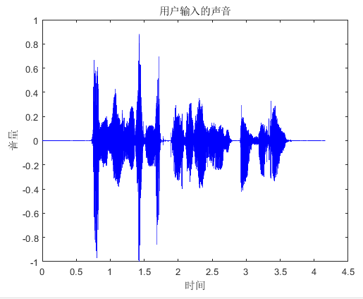

## 松鼠钱钱——基于人工智能的理财小程序

### 一.研究内容：

本项目是面向普通工薪阶层开发的理财小程序。随着社会财富的积累和个人生活水平的提高，如何理财成为了当下的一个热点话题。本项目最终成果为依托于人工智能技术的理财小程序，进行了如下几个方面的研究：

- 研究**语音识别、自然语言处理**等流行的人工智能技术，学习业界部署人工智能算法的经验。针对现有的记账APP的缺陷，如：繁琐、低智能化等，使用**语音识别、自然语言处理**等对其进行改善，简化记账流程；
- 对人工智能领域现有的**推荐算法**进行研究，学习投资界近几年新兴**“智能投顾” **常用的用户风险测评方式。使用机器学习中的**决策树算法**对用户的理财风格进行测评，根据测评结果给用户推荐相应的理财产品；
- 对用户的消费结构进行统计分析，研究学术界流行的**多元统计方法**。将用户的消费记录分成多个维度，对其进行数据分析，将结果进行全面详细且清晰明了的可视化，并从统计学的角度提出消费结构优化建议，在保证用户生活质量尽量维持不变的同时，为用户合理降低支出。

### 二.功能介绍：

- 记账方面：
  - 分为手动记账与语音记账两种模式，在传统记账方式的基础上增加**语音识别功能**，借助**自然语言处理技术**，实现语音录入收支信息，弥补了手动输入繁琐的缺点；
  - 通过微信小程序的云数据库存储和管理用户的消费记录；
  - 根据**多元统计分析方法**，对用户的收支数据进行数据分析，进而将记账数据可视化，使用户更加清晰地了解支出收入的金额、来源等，提出智能化的消费建议，从而使用户可以灵活调整自己的理财目标。
- 理财方面：
  - 基于**风险管理**的理论，以生命周期、用户对基金流动性的需求程度以及投资精力为依据，对用户的风险承受能力、理财观念等进行理财测评，并在云数据库中存储；
  - 基于现有的根据测评结果，借助机器学习中的**决策树**算法，将用户按照不同的投资风格进行分类，构建**用户画像 **，使用**推荐算法 **为每一类用户推荐专属化的理财产品；
  - 提供投资市场上现有的基金数据，方便用户自由选择各种基金。

如下是小程序的界面：

- 开始：

- 首页：

- 记账页面：

按住”语音记账“，说出自己的开销项目及金额，如”交通出行240元“，即可实现语音记账。

- 数据可视化：

- 消费分布：

- 消费曲线：

- 基金超市：

- 风险测评：

- 风险测评结果：

- 查看推荐的理财产品：

### 三.与同类产品相比的创新之处：

- 使用语音识别、自然语言处理等人工智能技术，简化了记账流程，克服了市场上现有记账APP繁琐、低智能化的弊端；
- 使用云数据库对用户的收支数据及风险评测数据进行存储与管理，简化了后端开发的流程；
- 小程序用户可以自定义可视化界面的收支信息，方便调整理财目标。
- 一般的理财app往往只关注通过购买理财产品增加用户收入，本项目在增加用户收入的同时，更关注了合理减少用户支出，优化用户消费结构。
- 在理财推荐方面，建立更精准的用户画像。本项目在一般风险测评的基础上，同时将用户以往的消费结构作为用户特点评估指标，从而获得对用户进行更精准的描述。

### 四.算法原理：

#### 1.语音识别：

用户按照格式“分类-金额-备注”录入语音，如“交通出行200元火车票”。

- ##### 语音预处理

  - 滤波
    - 基音的频率范围一般在60~450Hz之间，而通过计算机采集的语音信号，常常混有50Hz工频交流声，所以通过切比雪夫Ⅱ型高通滤波器滤除50Hz频率信号。
    - 滤除直流分量
  - 静音切除（VAD）
    - 录音文件的收尾两端往往存在静音段，为避免对后续识别造成影响，对其进行切除
    - 

- ##### 分帧

  - 按照一定帧长、步长对语音信号进行分帧（例如帧长25ms，步长15ms）
  - 

- ##### 提取声学特征

  - 根据人耳生理特性，逐帧提取声学特征（例如MFCC特征）。
  - 特征提取完毕后，每一帧都对应一个特征向量，现在整段声音转换为了矩阵表示。
  - 

- ##### 矩阵转文本

  - 将每一帧都识别为一个状态，然后再将状态组合成音素（通常三个状态=一个音素）
  - 最后将音素组合成字词并连接为句子
  - 

#### 2.文本分类：

- 上一步语音识别将用户语音识别为格式为“类别-金额-备注”的文本，例如“交通出行200元火车票”
- 按照第一个阿拉伯数字的位置和”元“字所在位置将文本切分为三段（交通出行-200元-火车票），分别填入账目相应项并存入数据库

#### 3.理财产品推荐方案：

- 基于生命周期理论，人的一生可以具体划分为单身、家庭建立、家庭成长、子女大学、家庭成熟以及退休养老等阶段，个人的风险承受能力随年龄的增长而降低，进而不同生命阶段对投资理财的需求程度也有所不同。基于不同收入对于生活需求满足能力的不同，收入较高的阶层不存在消费障碍，在现期消费满足的情况下可增加高风险高收益理财产品投资，从而实现财富大量积累；收入较低的阶层，满足基本消费后剩余较少；中等收入的阶层，介于两者之间，倾向于稳健型投资。同时基于用户对不同投资模式的倾向，可增加判断用户理财观念的比重。从而可以将用户划分为激进型、稳健型、保守型三种类型。基于上述根据用户对风险接受程度的划分，由于理财价值观念的差异，从而可以根据用户类型将其进行第一层划分；

- 按照用户对基金流动性的需求程度，理财投资承受时间可以具体划分为半年以内、三年以内、三至五年，不同种类的基金具有不同的特性，投资适宜时间也不同，进而用户不同的预期投资承受时间对应的适宜基金也有所不同，从而可以根据用户投资承受时间将其进行第二层划分；

- 根据用户个人富余精力与对投资重视程度的不同，每位用户在理财投资上预期耗费的精力也具有差异，而根据不同种类基金的特性，不同基金适合的投入时间与操作频率也有所不同，从而可以根据用户预期耗费精力对其进行第三层划分；

  基于上述理论，最终构建出如下的决策树模型：

  

  ​